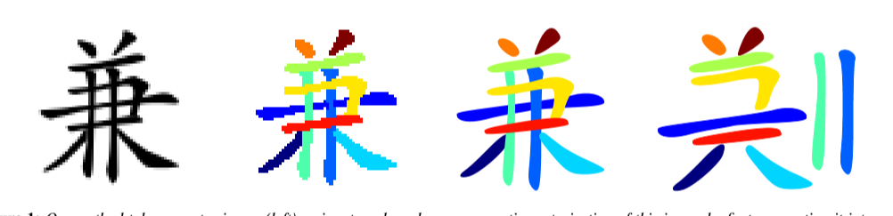
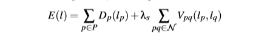
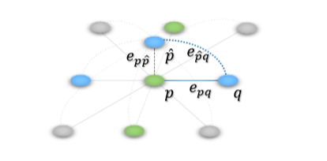
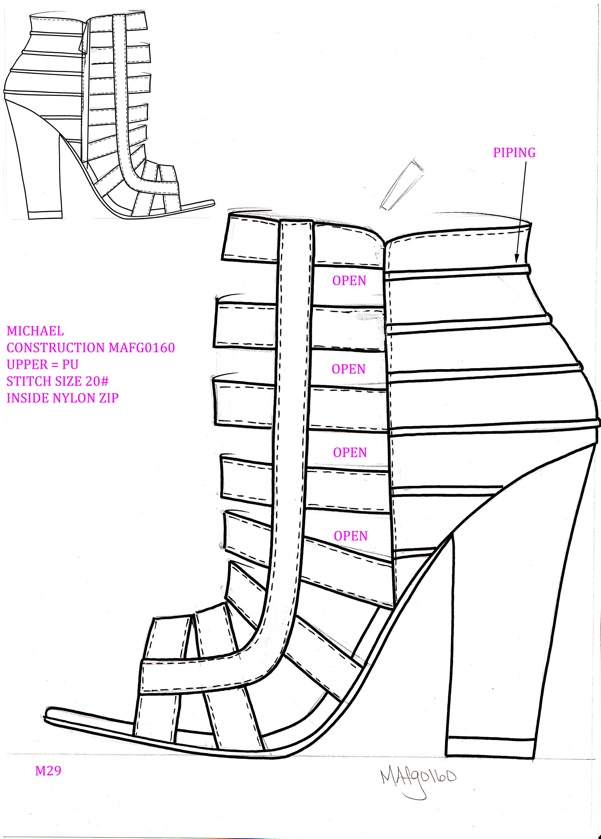
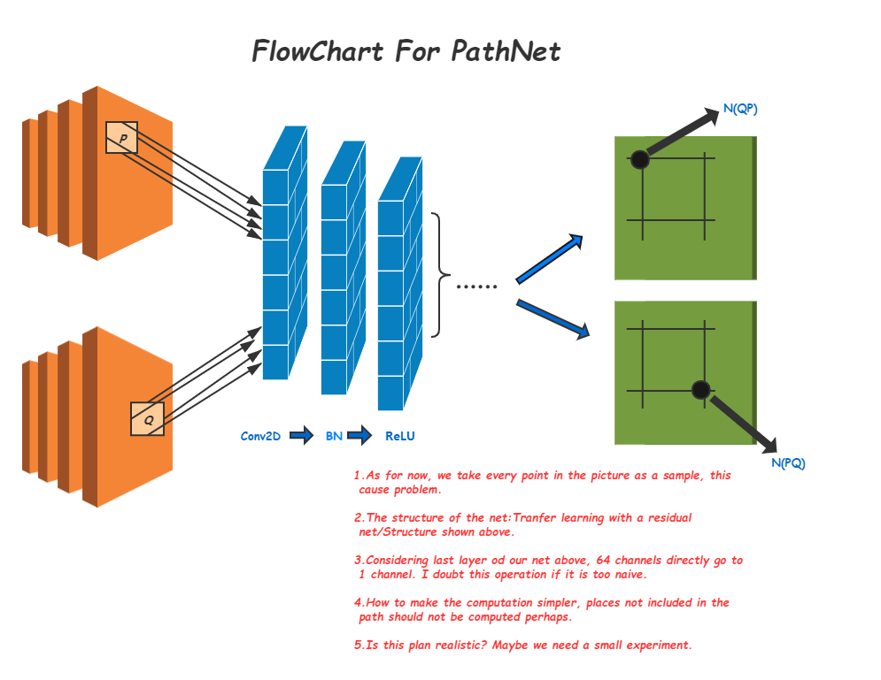
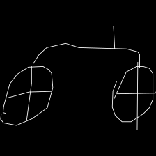

# Semantic_Segmentation
@Author ZeYuan MA

# 对设计手稿中线条的语义分割
## abstract
在这篇文章中，我们在已有的一些技术基础之上优化并提出了一种把设计手稿(鞋厂设计师手绘的用于三维建模的手绘稿)中的线条分割为矢量(vectorized)的方法。做这个研究的动机有以下几条：

>> 1. 线条的提取效率其实是很容易因为图像的质量问题而被影响。举个例子，如果一张图像中的线条很密集，那么传统的一些算法分离出来的结果就会丧失原本绘图者的语义。这个语义，其实就是那些像素其实属于同一条path。

>> 2. 现有的一些技术手段没有考虑图像中重叠的部分归属于哪条path的问题。

>> 3. 即使是最新的形如[Semantic Segmentation for Line Drawing Vectorization Using Neural Networks](http://www.byungsoo.me/project/vectornet/paper.pdf)的研究，也忽视了一些论证问题以及优化。


先上图，看看想要达到的效果：




我们的方案是将线条的分割问题总体上当作一个labelling问题。给定一张图片，那么所有的像素组成的集合 *P* 会被预先设定的一些label集合 *L* 中的某个 *l* 标记，那么我们参考一些经典的能量函数，定义两个标准分别来衡量单一像素的标记是否正确和任意相邻像素是否相似这两个指标。其实术语上就是data term 和 smooth term。 我们要优化的能量函数就是这样的一个式子:



优化上图公式的办法是将一张照片构建成一幅无向图 然后根据图割中的 $\alpha$ expansion算法和 $\alpha\beta$ swap算法对这个图进行一个最小割的求解


这么说很模糊，下面就说一下我们整个方案的流程: 第一步，训练path net，我们拿一张照片的灰度图作为一个channel，然后这张照片的某一个像素点作为一个channel，所以input就是224·224·2，经过二十个神经网络单元（CNN+BN+ReLU）得到一个输出为224·224·1。 这个矩阵是灰度图上每个像素和我们选定的这个像素的相似度，作为有监督学习，我们会从数据集中先构建好label。 第二步，训练overlapnet，这个网络的输入就是一张照片的灰度图224·224，经过同样的网络架构最后外加一个Sigmoid层+Threshold，输出则是224·224的矩阵，其中不为零的点是网络预测的发生重叠的区域。这也是一个有监督学习。 其实这两步的数据集的构建是我自己做的，根据一个开源的超级大的[数据集](https://github.com/googlecreativelab/quickdraw-dataset)。 简单来讲呢，有了第一个网络的输出，我们就有了公式中的后一项，有了第二个网络的输出呢，我们就可以构建一个完整的图网络，其中这些重复的点我们会在图网络中多构建一些节点，像这样： 


第三步也是最后一步，有了这两个网络，我们每次对一张照片，先随机分配标签，就可以根据图割的理论，把图的每条边的weight构建好，然后执行最小割，找到最优化的解。

PS: 我们做的优化主要是


1. 减少标签池数目，使用一种启发式的分配标签的方式代替随机，可以有效减少后后面图割优化的次数。
2. 改用RESNET来进行迁移学习，观察效果并对比。
3. 找一个符合metric特性的相似度度量函数以便于使用expansion算法 原论文中没有论证他的函数可以用就直接用了
4. 我们的应用场景是新的，附一张鞋稿:




A general statement of PathNet using a flowchart:
    
To get a quick start, just clone and run main.py.

# Tips: 如果想要贡献您的数据
我们十分感激想要做出贡献的热心人士，但考虑到贡献者对图像处理,文件处理等技术的了解程度不一致,我们提供了以下几种方式来帮助您准备能为本项目做贡献的数据.  
## 1.如果您了解矢量图:
> 矢量图的基本格式是:  
```
[ 
  [  // First stroke 
    [x0, x1, x2, x3, ...],
    [y0, y1, y2, y3, ...]
  ],
  [  // Second stroke
    [x0, x1, x2, x3, ...],
    [y0, y1, y2, y3, ...]
  ],
  ... // Additional strokes
]
```
如果您想直接为我们提供这种最标准的表示形式，我们需要一张灰度图片,还需要您为我们图片中上述轨迹对应的矢量表示。具体的数据组织形式可以使用csv或excel文件。这里以csv文件为例:  
> 文件由三列组成，表头分别为图片id，图片轨迹X坐标，图片轨迹Y坐标，示例文件可以参考[standard_sample.csv](./train_overlapnet/data.csv).样例图片如下:  
>   


## 如果您不了解矢量图:
> 您的图片应该有明显的*区分度*，最理想的情况是除了您的线条区域以外，其他区域像素为0。除了这张灰度照片，您也需要提供简单的轨迹坐标列表，形式同样为csv或excel。大致告诉我们每条线条的轨迹描述。

## 关于图片的一些参数
***不管您使用哪种方式提交您的贡献，以下参数都必须遵循***
1. 图片大小：标准的`224\*224`像素大小
2. 图片格式: `PNG`格式
3. 轨迹与非轨迹区域灰度差值`不应小于100`
4. csv文件(或excel)应`严格按照示例`进行编写.